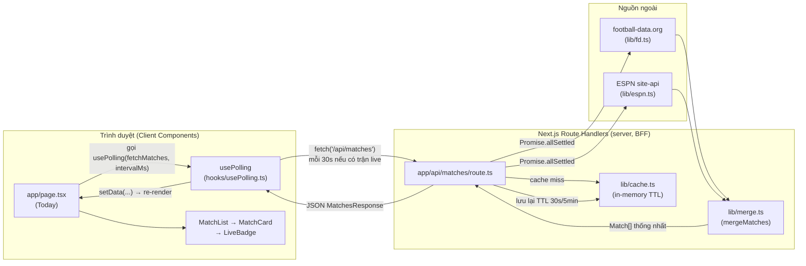

# Workflow Walkthrough — A→Z của một use case thật

> Mục đích: nối các mảnh rời (hook, state, memo, BFF, API client...) từ
> `docs/superpowers/plans/2026-07-16-mu-live-tracker-plan.md` thành **một luồng
> liên tục**, để đọc xong biết chính xác request đi qua file nào, ai gọi ai, ai
> giữ state gì. Đây không phải tài liệu khái niệm rời rạc như `LEARNING.md`
> (Task 28) — đây là một câu chuyện kể theo trình tự thời gian của đúng một
> hành động người dùng.
>
> Use case chọn: **"Đang mở trang Today, MU đang đá live, sau đó bấm vào xem
> chi tiết trận"** — vì nó chạm đủ mọi khái niệm: hook, state, effect chaining,
> BFF cache, hợp nhất 2 nguồn dữ liệu, useMemo.
>
> Số Task trong ngoặc = task tương ứng trong plan, nơi có full code.

## 0. Bản đồ tổng thể (1 hình)



## 1. Người dùng mở `/` (Today page)

**File:** `app/page.tsx` (Task 17 viết bản nháp fetch-once, Task 21 nâng cấp
thành bản polling thật — đoạn dưới đây là bản cuối, Task 21).

- Component mount lần đầu. React gọi `usePolling(fetchMatches, intervalMs)` với
  `intervalMs` khởi tạo = `300_000` (5 phút, giá trị an toàn tạm thời — lúc này
  còn chưa biết có trận live hay không).
- **State ở đây:** `intervalMs` là `useState` sống trong `TodayPage`, không
  phải trong hook — hook chỉ *nhận* nó làm tham số.

## 2. `usePolling` chạy effect đầu tiên

**File:** `hooks/usePolling.ts` (Task 19).

- `useEffect` với dependency `[intervalMs]` chạy ngay sau lần render đầu (giống
  `componentDidMount`).
- Bên trong, hàm `run()` gọi `fetcherRef.current()` — tức gọi `fetchMatches()`
  mà `TodayPage` truyền vào — **không gọi trực tiếp `fetcher` param** mà qua
  một `ref`. Lý do: `fetchMatches` là hàm khai báo lại mỗi lần render, nếu đưa
  thẳng vào dependency array thì effect (và `setInterval` bên trong) sẽ bị huỷ
  dựng lại ở *mọi* lần render, không chỉ khi `intervalMs` đổi thật.
- Cờ `cancelled` được tạo cho lần chạy effect này — nếu component unmount hoặc
  `intervalMs` đổi trước khi fetch xong, kết quả trả về muộn sẽ bị bỏ qua thay
  vì ghi đè state mới hơn.

## 3. `fetchMatches()` gọi sang BFF

```ts
async function fetchMatches(): Promise<MatchesResponse> {
  const res = await fetch('/api/matches');
  ...
}
```

Đây là điểm nối Client Component → server. Trình duyệt không bao giờ gọi
thẳng football-data.org hay ESPN — luôn qua route nội bộ này (lý do bảo mật:
`FOOTBALL_API_KEY` không bao giờ lộ ra client, xem Global Constraints trong
plan).

## 4. `app/api/matches/route.ts` — trái tim của BFF

**File:** Task 12.

1. `getCached<MatchesResponse>('matches')` (Task 7, `lib/cache.ts`) — nếu còn
   trong TTL (30s lúc có trận live, 5 phút lúc không), trả thẳng bản cache,
   **không** gọi football-data/ESPN lần nào. Đây là lý do vòng lặp polling 30s
   không làm cháy rate-limit 10 req/phút của football-data.org.
2. Cache miss (lần đầu, hoặc hết TTL): gọi song song bằng
   `Promise.allSettled([fetchMuMatches(apiKey), ...8 lần fetchEspnSchedule(slug)])`.
   `allSettled` (không phải `all`) là lý do một nguồn chết không kéo sập cả
   response — đây là cơ chế degrade của spec mục 8.
   - `fetchMuMatches` (Task 10, `lib/fd.ts`) → gọi thật
     `GET https://api.football-data.org/v4/teams/66/matches` với header
     `X-Auth-Token`.
   - `fetchEspnSchedule(slug)` (Task 11, `lib/espn.ts`) → gọi thật
     `GET https://site.api.espn.com/.../teams/360/schedule` cho từng giải
     (`eng.1`, `uefa.champions`, `eng.fa`, `eng.league_cup`, `club.friendly`).
3. `mergeMatches(fdMatches, espnEventsByCompetition)` (Task 9, `lib/merge.ts`)
   — đây là chỗ 2 nguồn thành 1:
   - Trận có ở cả FD lẫn ESPN (PL/CL) → FD làm nền (status/score), ESPN đè
     `minute`/status live nếu nhanh hơn (bài học từ WC-2026: FD lật
     `TIMED→IN_PLAY` chậm hơn ESPN).
   - Trận chỉ có ở ESPN (giao hữu, FA Cup, Carabao) → giữ nguyên từ ESPN.
   - Mỗi trận được gắn `venue: 'H' | 'A'` **theo góc nhìn MU** — đây là chỗ
     tạo ra "vs Arsenal (H)" thay vì cặp home/away trung lập (yêu cầu bản sắc
     MU, spec mục 7).
4. `setCached('matches', response, matchesTtlMs(matches))` — TTL được tính lại
   *sau khi* biết có trận `IN_PLAY`/`PAUSED` hay không → cache tự thu ngắn khi
   có trận đang đá.
5. Trả JSON `{ season, matches, meta: { sources: { fd, espn } } }`.

## 5. Dữ liệu quay lại `usePolling`, kéo theo state đổi

- `run()` trong `usePolling` nhận được `MatchesResponse`, gọi
  `setData(result)` — **state trong hook**, không phải trong `TodayPage`.
- `TodayPage` nhận `data` mới qua giá trị trả về của hook, re-render.

## 6. Effect thứ hai — "effect kéo effect"

```ts
useEffect(() => {
  if (data) setIntervalMs(pollingIntervalForMatches(data.matches));
}, [data]);
```

- `data` đổi (từ bước 5) → effect này chạy → gọi `pollingIntervalForMatches`
  (Task 19, `lib/polling.ts`, pure function): có trận `IN_PLAY`/`PAUSED` →
  30 000 ms; sắp đá trong 30 phút → 300 000 ms; không gì cả → `null`.
- `setIntervalMs(...)` đổi giá trị → đây lại là state của `TodayPage` →
  `intervalMs` mới được truyền lại vào `usePolling` → effect ở bước 2 (phụ
  thuộc `[intervalMs]`) chạy cleanup (huỷ interval cũ) rồi tạo interval mới
  đúng 30s vì đang có trận live.
- Đây là ví dụ thật của "một state update kích hoạt effect, effect đó lại
  kích hoạt state update khác" — dễ bị bỏ sót lần đầu gặp, ghi lại trong
  `LEARNING.md` mục 3.

## 7. Render danh sách — props, list, key, conditional rendering

**File:** `components/MatchList.tsx` (Task 16) → `components/MatchCard.tsx`
(Task 15) → `components/LiveBadge.tsx` (Task 20).

- `TodayPage` lọc `data.matches` theo ngày hôm nay, đưa mảng xuống
  `<MatchList matches={todayMatches} />` — **props thuần túy**, không có state
  nào ở tầng này.
- `MatchList` map qua mảng, `key={match.id}` (khoá ổn định = ngày + tên đối
  thủ đã chuẩn hoá — xem Task 9) để React ghép đúng DOM node cũ/mới giữa các
  lần poll, không dựng lại toàn bộ danh sách mỗi 30 giây.
- `MatchCard` đọc `match.status` để quyết định: có bọc `<Link>` hay không
  (chỉ `IN_PLAY`/`PAUSED`/`FINISHED` mới click được — Task 15), và gọi
  `isFergieTime(match)` (Task 20) để chọn hiển thị `"FERGIE TIME"` thay vì phút
  thường khi MU đang hoà/thua ở phút 90+.
- Không có `useMemo` nào ở đây — `isFergieTime` và việc lọc danh sách đều rẻ,
  chạy lại mỗi lần render là bình thường (tương phản có chủ đích với bước 10).

## 8. Người dùng bấm vào 1 trận đang live

`MatchCard` build sẵn:
```
/match/{match.id}?espnId={match.sources.espn}&slug={espnSlug}
```
`match.id` (khoá hợp nhất, vd `2026-08-22_hullcityafc`) chỉ dùng để định danh
URL; `espnId` + `slug` mới là thứ trang chi tiết cần để gọi ESPN — tránh phải
"đảo ngược" từ khoá hợp nhất ra ID gốc ở phía server.

## 9. `app/match/[id]/page.tsx` — vòng polling thứ hai, độc lập

**File:** Task 27.

- Đọc `espnId`/`slug` từ query string (`useSearchParams`), gọi **một
  `usePolling` khác**, độc lập hoàn toàn với vòng polling của Today page (mỗi
  page có state/hook riêng, không chia sẻ).
- `intervalMs` ở trang này khởi tạo `null` (không poll), rồi một `useEffect`
  y hệt mẫu ở bước 6 đọc `data.header.competitions[0].status.type.state` — nếu
  `'in'` thì set `30_000`, ngược lại `null` (trận đã xong thì không cần poll
  nữa — khác Today page, nơi luôn có nhịp polling nền).

## 10. `app/api/match/[id]/route.ts` gọi ESPN `/summary`

**File:** Task 14 → `fetchEspnDetail(slug, espnId)` (Task 11) →
`GET .../summary?event=...` — endpoint **khác** với schedule ở bước 4 (schedule
không có `.details`/play-by-play, chỉ `/summary` mới có — điều này đã được
xác minh thật bằng curl trước khi viết plan, không phải suy đoán).

## 11. `useMemo` xuất hiện — đối lập với bước 7

**File:** `components/FormationPitch.tsx` (Task 24), dùng
`buildFormationRows` (Task 23, port từ `WC-2026-live-tracker/utils.js`).

```ts
const homeRows = useMemo(
  () => buildFormationRows(homeRoster?.roster, homeRoster?.formation),
  [homeRoster],
);
```

- Trang chi tiết trận **re-render mỗi 30 giây** khi trận đang live (bước 9).
  `buildFormationRows` sắp xếp lại toàn bộ đội hình 11 người mỗi lần gọi — rẻ,
  nhưng nếu roster/formation không đổi giữa 2 lần poll (thường là vậy, đội
  hình không đổi giữa hiệp), việc tính lại là phí. `useMemo` khoá theo
  `homeRoster` — object mới chỉ được tạo khi response `/summary` thật sự khác.
- So sánh trực tiếp với `components/CupRun.tsx` (Task 25) — **cố tình không
  dùng `useMemo`** vì lọc vài trận cúp là rẻ, không đáng thêm một tầng cache.
  Đây là bài học: `useMemo` là fix cho một chi phí đo được, không phải phản xạ
  mặc định (`LEARNING.md` mục 5).

## Bảng tra nhanh: khái niệm ↔ nơi thấy nó trong luồng trên

| Khái niệm | Xuất hiện ở bước | File |
|---|---|---|
| Props + conditional rendering | 7 | `MatchCard.tsx` |
| List + stable key | 7 | `MatchList.tsx` |
| State (`useState`) | 1, 5, 6, 9 | `page.tsx`, `usePolling.ts` |
| `useEffect` + cleanup | 2, 6, 9 | `usePolling.ts`, `page.tsx` |
| Ref tránh stale closure | 2 | `usePolling.ts` |
| Effect kéo effect | 6 | `page.tsx` |
| BFF / Route Handler | 4, 10 | `app/api/matches/route.ts`, `app/api/match/[id]/route.ts` |
| Hợp nhất 2 nguồn dữ liệu | 4 | `lib/merge.ts` |
| Cache TTL động | 4 | `lib/cache.ts` |
| `useMemo` (có dùng) | 11 | `FormationPitch.tsx` |
| Derived state (không dùng memo) | 7, 11 | `LiveBadge.tsx` (isFergieTime), `CupRun.tsx` |
| Context (không nằm trong luồng này) | — | `CompetitionFilterContext.tsx` (Task 22) — chỉ dùng ở Schedule/nav, xem ví dụ riêng trong `LEARNING.md` mục 4 |

## Use case thứ hai, tóm tắt (để đối chiếu): lọc lịch theo giải

Không lặp lại chi tiết — chỉ khác luồng trên ở đúng một chỗ: `Schedule` page
không tự giữ state bộ lọc (khác Task 18 bản đầu) mà đọc từ
`useCompetitionFilter()` (Context, Task 22), vì pill chọn giải nằm ở
`app/layout.tsx` (dùng chung cho mọi trang) còn danh sách trận nằm ở trang
`Schedule` — hai component này không phải cha-con nên không thể "lift state
up" được nữa, buộc phải dùng Context. Xem `LEARNING.md` mục 4 để đọc lý do đầy
đủ.
